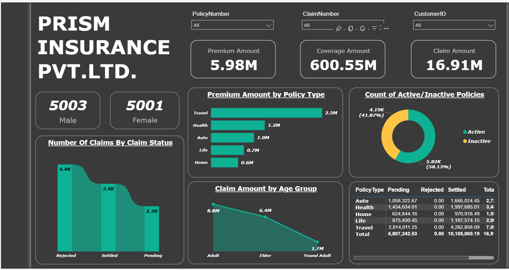

# 🧾 PRISM INSURANCE PVT. LTD. – Insurance Data Analytics Dashboard

_Analyzing insurance policies, customer demographics, premium distribution, and claim trends using Python, SQL, Excel, and Power BI._

---

## 📌 Table of Contents
- <a href="#overview">Overview</a>
- <a href="#business-problem">Business Problem</a>
- <a href="#dataset">Dataset</a>
- <a href="#tools--technologies">Tools & Technologies</a>
- <a href="#project-structure">Project Structure</a>
- <a href="#data-cleaning--preparation">Data Cleaning & Preparation</a>
- <a href="#exploratory-data-analysis-eda">Exploratory Data Analysis (EDA)</a>
- <a href="#research-questions--key-findings">Research Questions & Key Findings</a>
- <a href="#dashboard">Dashboard</a>
- <a href="#how-to-run-this-project">How to Run This Project</a>
- <a href="#final-recommendations">Final Recommendations</a>
- <a href="#author--contact">Author & Contact</a>

---

<h2><a class="anchor" id="overview"></a>Overview</h2>

This project focuses on analyzing insurance customer behavior, policy performance, premium collection, coverage distribution, and claim trends for **PRISM INSURANCE PVT. LTD.**

The dashboard was built using **Power BI** to provide interactive insights into insurance operations and help improve strategic decision-making through data analytics.

The project includes:
- Customer demographic analysis
- Policy performance tracking
- Claim status monitoring
- Premium and coverage analysis
- Financial KPI reporting

---

<h2><a class="anchor" id="business-problem"></a>Business Problem</h2>

Insurance companies manage thousands of policies and claims daily. This project aims to:

- Analyze policy performance across insurance categories
- Monitor customer demographics and engagement
- Track claim approval, settlement, and pending cases
- Identify high-performing insurance products
- Improve risk assessment and business decisions
- Optimize premium and claim management strategies

---

<h2><a class="anchor" id="dataset"></a>Dataset</h2>

The dataset contains insurance-related records including:

- Customer Information
- Insurance Policies
- Premium Amounts
- Coverage Amounts
- Claim Details
- Claim Status

### Dataset Summary
- Total Records: **10,004**
- Total Columns: **13**

### Columns Included
- Policy Number
- Customer ID
- Gender
- Age
- Policy Type
- Policy Status
- Policy Start Date
- Policy End Date
- Premium Amount
- Coverage Amount
- Claim Number
- Claim Amount
- Claim Status

---

<h2><a class="anchor" id="tools--technologies"></a>Tools & Technologies</h2>

- Power BI
- Python (Pandas, NumPy)
- SQL
- Microsoft Excel
- Data Visualization
- GitHub

---

<h2><a class="anchor" id="project-structure"></a>Project Structure</h2>

```text
insurance-data-analytics/
│
├── README.md
├── InsuranceData.csv
├── requirements.txt
├── Insurance_Report.pdf
│
├── notebooks/
│   └── insurance_analysis.ipynb
│
├── scripts/
│   ├── data_cleaning.py
│   └── insurance_summary.py
│
├── dashboard/
│   └── prism_insurance_dashboard.pbix
│
├── images/
│   └── dashboard.png
```

---

<h2><a class="anchor" id="data-cleaning--preparation"></a>Data Cleaning & Preparation</h2>

The following preprocessing steps were performed:

- Removed duplicate records
- Handled missing/null values
- Converted date columns into proper datetime format
- Standardized policy and claim categories
- Cleaned inconsistent customer records
- Validated premium and claim amounts
- Created summary tables for dashboard analysis

---

<h2><a class="anchor" id="exploratory-data-analysis-eda"></a>Exploratory Data Analysis (EDA)</h2>

### Customer Demographics
- Male Customers: **5003**
- Female Customers: **5001**

### Financial KPIs
- Premium Amount: **5.98M**
- Coverage Amount: **600.55M**
- Claim Amount: **16.91M**

### Policy Analysis
- Travel Insurance generated the highest premium amount
- Health and Auto policies showed strong customer participation

### Claim Analysis
- Rejected Claims: **4.4K**
- Settled Claims: **3.4K**
- Pending Claims: **2.3K**

### Policy Status
- Active Policies: **58.13%**
- Inactive Policies: **41.87%**

### Age Group Analysis
- Adults generated the highest claim amount
- Young Adults contributed the lowest claim value

---

<h2><a class="anchor" id="research-questions--key-findings"></a>Research Questions & Key Findings</h2>

1. **Top Performing Policy Type**
   - Travel Insurance contributed the highest premium revenue.

2. **Customer Distribution**
   - Male and Female customers were almost equally distributed.

3. **Claim Insights**
   - Rejected claims were higher compared to pending claims.

4. **Policy Activity**
   - More than half of the policies remained active.

5. **Age Group Trends**
   - Adult customers generated maximum claim amounts.

6. **Business Performance**
   - Premium and coverage metrics indicate strong business growth.

---

<h2><a class="anchor" id="dashboard"></a>Dashboard</h2>

### Power BI Dashboard Includes:
- Premium Amount Analysis
- Coverage Amount Overview
- Claim Amount Tracking
- Policy Type Analysis
- Customer Demographics
- Claim Status Distribution
- Active vs Inactive Policies
- Age Group Claim Trends
- Interactive Filters & Slicers



---

<h2><a class="anchor" id="how-to-run-this-project"></a>How to Run This Project</h2>

1. Clone the repository:
```bash
git clone https://github.com/yourusername/insurance-data-analytics.git
```

2. Install required libraries:
```bash
pip install -r requirements.txt
```

3. Run Python scripts:
```bash
python scripts/data_cleaning.py
```

4. Open Jupyter Notebook:
```bash
jupyter notebook
```

5. Run notebook:
```text
notebooks/insurance_analysis.ipynb
```

6. Open Power BI Dashboard:
```text
dashboard/prism_insurance_dashboard.pbix
```

---

<h2><a class="anchor" id="final-recommendations"></a>Final Recommendations</h2>

- Improve claim approval efficiency
- Reduce pending claim processing time
- Focus on high-performing policy categories
- Enhance customer segmentation strategies
- Strengthen fraud detection systems
- Improve retention of inactive policyholders

---

<h2><a class="anchor" id="author--contact"></a>Author & Contact</h2>

**Abhishek Kumar**  
B.Tech CSE Student | Data Analytics Enthusiast  

📧 Email: abhishek6200singh@gmail.com  
🔗 LinkedIn: https://www.linkedin.com/in/abhishek9500/ 
🔗 GitHub: https://github.com/Abhishek9500

---

## 📜 License

This project is created for educational and learning purposes.